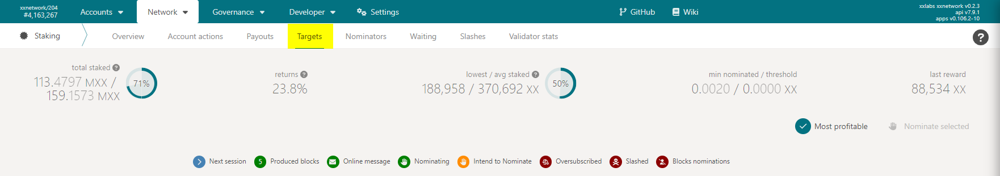

# Создание аккаунта

В процессе создания аккаунта будет сгенерированы две <mark style="color:red;">сид фразы, адрес и ключ</mark>


Настоятельно рекомендуется отключить интернет-соединение до окончания процесса создания кошелька. Этот процесс полностью выполняется в браузере, поэтому подключение к Интернету не требуется. Кроме того, не продолжайте процесс, если вы считаете, что ваш браузер может быть заражен вредоносным ПО.


#### Также не рекомендовано:

* Делать скриншоты или фото генерируемых сид фраз и прочей информации в процессе создания аккаунта
* Сохранение информации в незашифрованном текстовом документе
* Делиться этой информацией с любым недоверенным человеком или приложением

#### Рекомендовано:

* Записать фразу восстановления с индексами на бумаге
* Сохранить эту информацию в безопасном от кражи и повреждений месте
* Использовать аппаратный кошелек

Создание аккаунта происходит на странице [https://wallet.xx.network/#/accounts/generate](https://wallet.xx.network/#/accounts/generate).

Переходим по адресу, отмечаем две галочки, подтверждая что мы отлючили интернет-соединение, либо принимаем риски оставшись онлайн и тот факт что наш браузер не скосмпроментирован. После чего начинаем процесс регистрации нажатием кнопки 'Generate New Wallet'.

<figure><figcaption></figcaption></figure>

Генерируются две сид фразы. Первая так называемая квантовая мнемоника, эта сид фраза будет использоваться тогда, когда консенсус сети **xx** перейдет на квантово-безопасные сигнатуры. Стандартная сид фраза генерируется на базе этой мнемоники. Вторая сид фраза это стандартная мнемоника и используется для восстановления доступа к кошельку или для установки аппаратного кошелька.&#x20;

<figure><figcaption>
Записываем сид фразы вместе с нумерацией.
</figcaption></figure>

